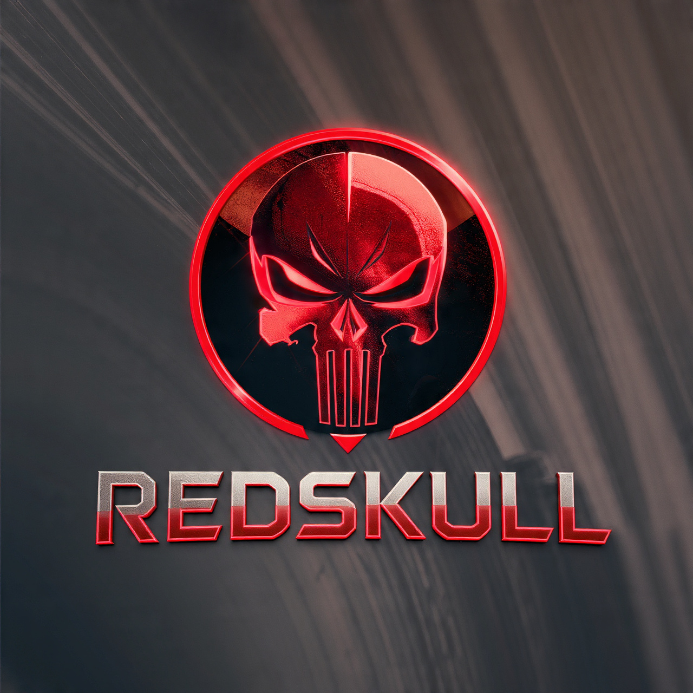

<h1 align="center">RedSkull WhatsApp Bot</h1>

  

  A multi-feature WhatsApp bot built on Baileys. Economy, card collection, canvas games, reactions, downloads, and more — all in one.

  
  
  

<h2>⚠️ Node.js Version Requirement</h2>

This bot uses native graphics libraries (<code>canvas</code>, <code>sharp</code>) for card generation, chess boards, and sticker processing. <strong>You must run Node.js 20 (LTS)</strong>. Bleeding-edge versions (Node 22, 23, 24+) fail to resolve prebuilt binaries and cause silent crashes.

Use a version manager like <code>fnm</code> or <code>nvm</code> to pin Node 20.

<h2>Features</h2>

<table>
  <thead>
    <tr>
      <th>Category</th>
      <th>What's Inside</th>
    </tr>
  </thead>
  <tbody>
    <tr><td><strong>Economy</strong></td><td>Wallet, bank, orbs, daily rewards, rob, gamble, dig, fish</td></tr>
    <tr><td><strong>Card Collection</strong></td><td>Anime &amp; Pokémon spawning, catching, trading, battles</td></tr>
    <tr><td><strong>Games</strong></td><td>Tic Tac Toe, Chess (canvas), Word Guess, Truth or Dare</td></tr>
    <tr><td><strong>Reactions</strong></td><td>27+ anime GIF reactions — kiss, hug, slap, pat, cuddle, and more</td></tr>
    <tr><td><strong>Downloads</strong></td><td>YouTube (video/audio), Instagram, Facebook, Pinterest, TikTok</td></tr>
    <tr><td><strong>AI</strong></td><td>GPT chat, image generation</td></tr>
    <tr><td><strong>Fun Cards</strong></td><td>Troll, gay pride, wanted poster, fake tweet, licenses — all canvas-generated</td></tr>
    <tr><td><strong>Group Management</strong></td><td>Tag all, antilink, mute, kick, promote, demote, purge</td></tr>
    <tr><td><strong>Stickers &amp; QC</strong></td><td>Quote sticker maker, image-to-sticker, view-once revealer</td></tr>
    <tr><td><strong>Honor Board</strong></td><td>Ranks players by wealth, cards, and training</td></tr>
    <tr><td><strong>Deploy Guide</strong></td><td>Built-in <code>.deploy</code> command for all platforms</td></tr>
  </tbody>
</table>

<h2>Prerequisites</h2>

<ul>
  <li>Node.js 20 (LTS)</li>
  <li>Git</li>
  <li>FFmpeg</li>
  <li>yt-dlp</li>
  <li>A WhatsApp account (secondary recommended)</li>
</ul>

<h2>Termux (Android) — <em>not fully tested</em></h2>

<pre><code>termux-wake-lock
pkg update &amp;&amp; pkg upgrade -y
pkg install nodejs-lts git ffmpeg python -y
pip install yt-dlp
pkg install chromium -y
git clone https://github.com/hanifssh/redskull.git
cd redskull
npm install
npx playwright install chromium
node index.js</code></pre>

Scan the QR code with WhatsApp. For 24/7 uptime:

<pre><code>npm install -g pm2
pm2 start index.js --name redskull
pm2 save</code></pre>

<blockquote>
  
Termux users may face native module compilation issues with <code>canvas</code> and <code>sharp</code>. If that happens, run <code>npm rebuild canvas --build-from-source</code> and <code>npm rebuild sharp --build-from-source</code>.

</blockquote>

<h2>Ubuntu / Debian</h2>

<pre><code>sudo apt update &amp;&amp; sudo apt upgrade -y
sudo apt install -y git ffmpeg python3-pip chromium-browser \
    build-essential libcairo2-dev libpango1.0-dev libjpeg-dev \
    libgif-dev librsvg2-dev

curl -fsSL https://deb.nodesource.com/setup_20.x | sudo -E bash -
sudo apt install nodejs -y

pip3 install yt-dlp

git clone https://github.com/hanifssh/redskull.git
cd redskull
npm install
npx playwright install chromium
node index.js</code></pre>

<h2>Arch Linux</h2>

<pre><code>sudo pacman -Syu
sudo pacman -S --needed base-devel cairo pango libjpeg-turbo giflib \
    librsvg libvips git ffmpeg yt-dlp chromium

sudo pacman -S fnm
eval "$(fnm env)"
fnm install 20
fnm use 20

git clone https://github.com/hanifssh/redskull.git
cd redskull
npm install
npx playwright install chromium
node index.js</code></pre>

<blockquote>
  
If <code>sharp</code> fails on Arch due to its bleeding-edge system libraries, run:

  <pre><code>rm -rf node_modules/sharp node_modules/wa-sticker-formatter/node_modules/sharp
SHARP_IGNORE_GLOBAL_LIBVIPS=1 npm install sharp@0.30.7 --ignore-scripts=false</code></pre>
</blockquote>

<h2>Docker</h2>

<pre><code>git clone https://github.com/hanifssh/redskull.git
cd redskull
docker build -t redskull .
docker run -d --name redskull --restart unless-stopped \
    -v $(pwd)/sessions:/app/sessions \
    -v $(pwd)/database:/app/database \
    redskull</code></pre>

First-time pairing (interactive terminal required):

<pre><code>docker run -it --rm \
    -v $(pwd)/sessions:/app/sessions \
    -v $(pwd)/database:/app/database \
    redskull node index.js --pair --phone=YOUR_NUMBER</code></pre>

Or use the included compose file:

<pre><code>docker-compose up -d
docker-compose logs -f</code></pre>

<h2>Contributing</h2>

Pull requests are welcome. For major changes, open an issue first to discuss what you'd like to change.

<h2>Disclaimer</h2>

This bot is for educational purposes only. Use responsibly. The developer is not responsible for any misuse or account bans.

<h2>License</h2>

<a href="LICENSE">MIT</a>

  Made with 🤍 by <a href="https://github.com/hanifssh">Hanif</a>

